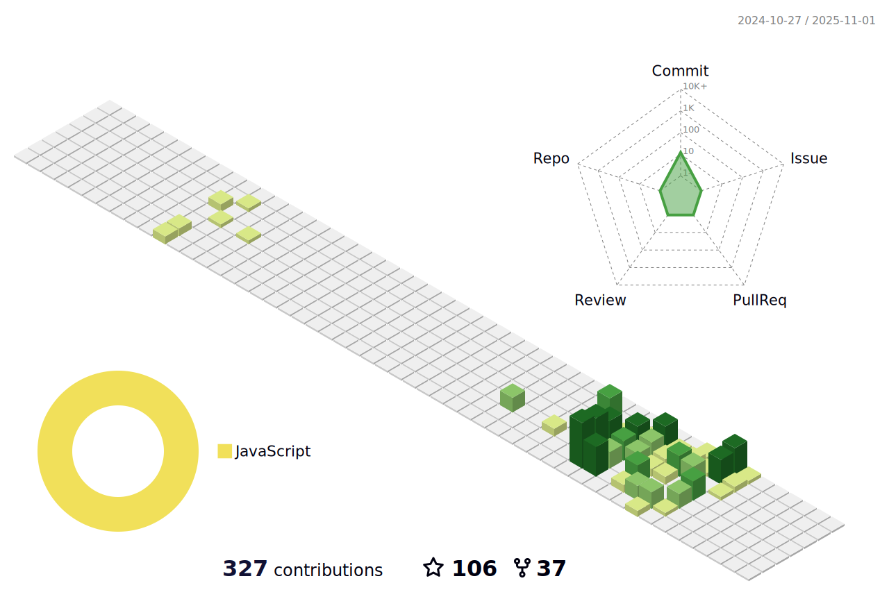

# I'm John Dave Manuel 👋

### I'm a front-end web developer.

Building simple and beautiful things for complex interfaces is what I enjoy most about my work. I am also interested in crafting beautiful minimal products and exploring new worlds.

🔭 I’m currently working on different e-commerce projects.

🌱 I’m currently learning React, Express and Typescript.

👯 I’m looking to collaborate on React projects.

🤔 I’m looking for help with developer roadmap.

💬 Ask me about web.

😄 Pronouns: He / Him

⚡ Fun fact:  I do believe in extraterrestrial life.

 

## :chart_with_upwards_trend: Github Stats

## :trophy: Github Awards

## :trophy: Contributions

## :zap: Recent Activity
<!--START_SECTION:activity-->
1. 🗣 Commented on [#194](https://github.com/newerton/bombcrypto-bot/issues/194) in [newerton/bombcrypto-bot](https://github.com/newerton/bombcrypto-bot)
<!--END_SECTION:activity-->
